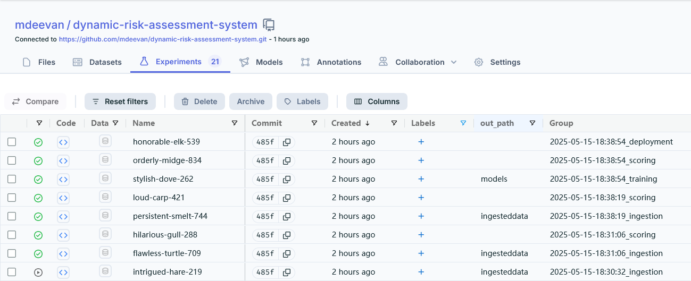

# Dynamic Risk Assessment System
Create, deploy, and monitor a risk assessment ML model that will estimate the attrition risk for the company. Model is regularly monitored to ensure  it remains accurate and up-to-date by setting up processes and scripts to re-train, re-deploy, monitor, and report on  ML model with availability of new data. This ensures that company can get risk assessments that are as accurate as possible and minimize client attrition.  

Project made use of the following  
|   | Description |  
| ---- | ----- |  
|MLFlow | to capture the experiments |
| Dagshub | to capture and store the experiments |  
|FastAPI | to expose the functionality via API
|Sklearn | for Machine learning |
|Pandas | for data manipulation |
|Hydra| to allow selective override of the parameters |
|   |   |
  
    


# Creating environment

- for this project, I made use of Ubuntu 22 on AWS t3.medium EC2 instances with  30 GB of Storage    

to connect the VSCODE, install the 'remote explorer' extension and configure the .ssh config file  
>Host MLOPS2-EC2-UBUNTU   
    HostName ec2-35-170-79-232.compute-1.amazonaws.com  
    User ubuntu  
    IdentityFile /Users/mnave/.ssh/MLOPS2.pem  

### Environment creation options
#### python virtualenv
- create environment as follows and then activate  
`python3 -m vevn .venv  # this creates the environment`

- Activate the environment  
`source ./.venv/bin/activate`  

Alternately, add "`source ./.venv/bin/activate`" as a last line in **.bashrc file**. This activates the environment everytime the terminal is opened  

#### conda environment
- follow instructions here to install [miniconda or anaconda](https://www.anaconda.com/docs/getting-started/miniconda/install#linux-terminal-installer)  

* download miniconda
wget https://repo.anaconda.com/miniconda/Miniconda3-latest-Linux-x86_64.sh

* download, install miniconda  
````
    wget https://repo.anaconda.com/miniconda/Miniconda3-latest-Linux-x86_64.sh
    bash ~/Miniconda3-latest-Linux-x86_64.sh
````
- once the installaton is successful. create enviornment. it uses environment.yml file
make create-conda-env

once the installaton is successful. create enviornment. it uses environment.yml file
make update-env


#### Troubleshooting
in case of issue in creating environment. following the following steps  
`sudo apt-get update`  
`sudo apt install python3-dev`  
`sudo apt install python3-venv`


### Clone the repository
`git clone https://github.com/mdeevan/dynamic-risk-assessment-system.git`

### DAGSHUB
DAGSHUB will be used to track the data and model versioning (Data version control), while GITHUB will be used for the code   

ingestion, scoring, training, deployment are tracked via MLFlow. These are independent scripts, but are grouped under shared suffix when run together.


generate the token and configure in the enviornment to allow logging experiments  

`
export MLFLOW_TRACKING_USERNAME=mdeevan  
export MLFLOW_TRACKING_PASSWORD=cffbcbe17a5519468e0cff1f2a2fc472c527c9d3
`

# Data Structure

| attribute | description |
| ---| ----|
|corporation |   four-character abbreviations for names of corporations  |
|lastmonth_activity |  level of activity associated with each corporation over the |previous month  |    |  
|lastyear_activity |  level of activity associated with each corporation over the |previous year  |  |  
|number_of_employees | number of employees who work for the corporation |  |  
|exited | record of whether the corporation exited their contract (1 indicates that the corporation exited, and 0 indicates that the corporation did not exit) |  |  

# Folder Structure
| path/file  | description |   
| ----  | ---- |   
| .   |  root    |   
| ├── README.md   |   This file   |   
| **CONFIGURATION**   |      |   
| ├── config   |      |   
| │   ├── config.yaml   | Configurable parameters for the project     |   
| │   ├── python_env.yaml   |  python enviornment configuration, refers requirements.txt    |   
| │   ├── environment.yml   |  conda enviornment configuration, refers requirements.txt    |   
| │   └── requirements.txt   | requirements file     |   
| **DATA**   |      |   
| ├── ingesteddata   |  processed data via ingestion    |   
| │   ├── finaldata.csv   |      |   
| │   └── ingestedfiles.txt   |      |   
| ├── practicedata   |  initial dataset to setup the project    |   
| │   ├── dataset1.csv   |      |   
| │   └── dataset2.csv   |      |   
| ├── sourcedata   |  final dataset to simulate change of data    |   
| │   ├── dataset3.csv   |      |   
| │   └── dataset4.csv   |      |   
| ├── testdata   | Test data set for model scoring     |   
| └── └── testdata.csv
| **OUTPUT**   |      |   
| ├── apireturns.txt   |    output of diagnostics called from apicalls.py  |   
| ├── apireturns_diagnostics.txt   |  output from diagnostics    |   
| ├── models   |  results from fullprocess.py using sourcedata   |   
| │   ├── apireturns2.txt   |       |   
| │   ├── confusionmatrix2.png   |      |   
| │   ├── latestscore.txt   |      |   
| │   ├── predictions.csv   |      |   
| │   └── trainedmodel.pkl   |      |   
| ├── practicemodels   |   results with initial dataset   |   
| │   ├── apireturns2.txt   |      |   
| │   ├── confusionmatrix2.png   |      |   
| │   ├── latestscore.txt   |      |   
| │   ├── predictions.csv   |      |   
| │   └── trainedmodel.pkl   |      |   
| ├── production_deployment   |   Deployed code   |   
| │   ├── confusionmatrix.png   |      |   
| │   ├── finaldata.csv   |      |   
| │   ├── ingestedfiles.txt   |      |   
| │   ├── latestscore.txt   |      |   
| │   └── trainedmodel.pkl   |      |   
| ├── report   |   result of the diagnostics   |   
| │   ├── null_values.csv   |      |   
| │   ├── outdated_packages.txt   |      |   
| │   ├── predictions.csv   |      |   
| │   ├── predictions_diag.csv   |      |   
| │   ├── statistics.csv   |      |   
| │   └── timings_diag.csv   |      |   
| **SOURCE CODE**   |      |   
| ├── apicalls.py   | call the FastAPI to fetch diagnostics output     |   
| ├── main.py   |   Main module for ingestion, scoring, prediction, training and deployment   |   
| ├── MLproject   |  configuration of ML Project (main.api)    |   
| ├── src   |      |   
| │   ├── app.py   |  FastAPI code    |   
| │   ├── lib   |   Utilties    |   
| │   │   └── utilities.py   |      |   
| │   ├── diagnostics.py   |  Diagnostics (replacing the MLFlow version)    |   
| │   ├── fullprocess.py   |  Execute the full pipeline    |   
| │   ├── ingest_score.sh   |  script to invoke ingest and score MLFlow    |   
| │   ├── train_deploy.sh   |  script to invoke training and deployment MLFlow    |   
| │   ├── reporting.py   |  generate confusion matrix    |   
| _**MLFlow code**_   |      |   
| │   ├── data_ingestion   |  Data Ingestion     |   
| │   │   ├── MLproject   |      |   
| │   │   ├── ingestion.py   |      |   
| │   ├── deployment   |   Deployment   |   
| │   │   ├── MLproject   |      |   
| │   │   └── deployment.py   |      |   
| │   ├── scoring_model   |  Score the model performance    |   
| │   │   ├── MLproject   |      |   
| │   │   └── scoring.py   |      |   
| │   ├── training   | run the training     |   
| │   │   ├── MLproject   |      |   
| │   │   └── training.py   |      |   
| │   ├── diagnostics   |  Diagnostics (no longer used)   |   
| │   │   ├── MLproject   |      |   
| │   │   └── diagnostics.py   |      |   
| │   ├── reporting   |  reporting - confusion matrix  (not used)  |   
| │   │   ├── MLproject   |      |   
| │   │   └── reporting.py   |      |   

# Program Flow


Execute the full flow by calling   
`python src/fullprocess.py `

Run the FastAPI server as follows  
`uvicorn app:app --app-dir src`

**apicalls.py** is dependent on the FastAPI service, once available it generate diagnostics (**apiruns.txt**)  
`python apicalls.py `

generate reporting (**confusionmatrix.png**)  
`python src/reporting.py `

Diagnostics can be executed independtly  
`python src/diagnostics.py`  


## Experiment Tracking
